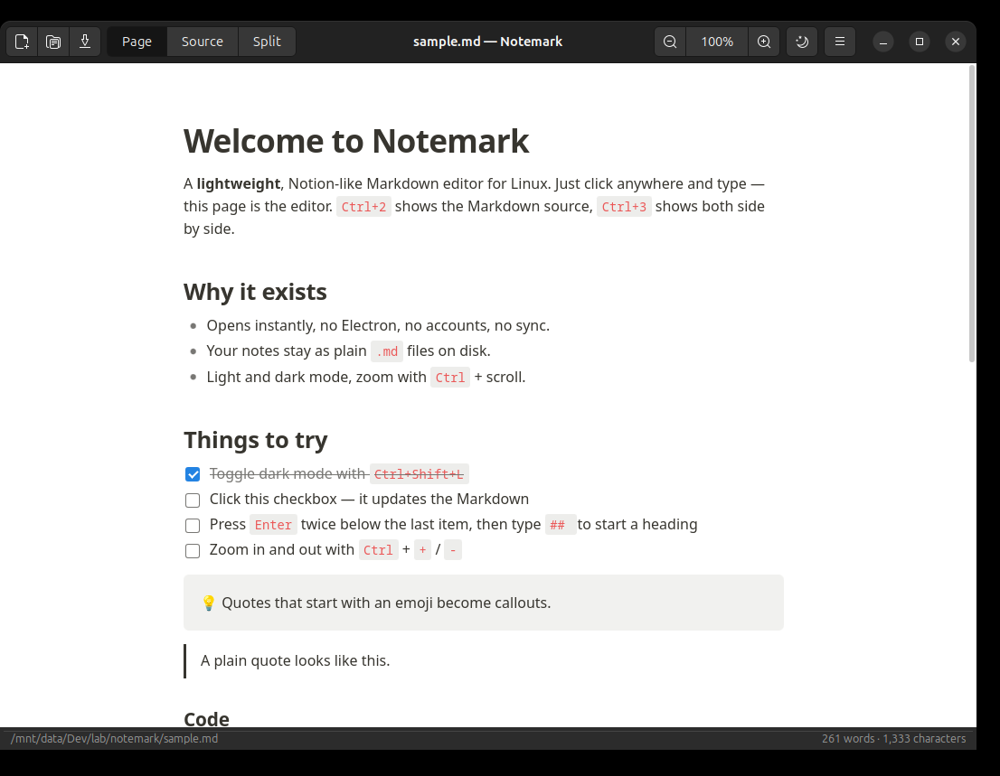
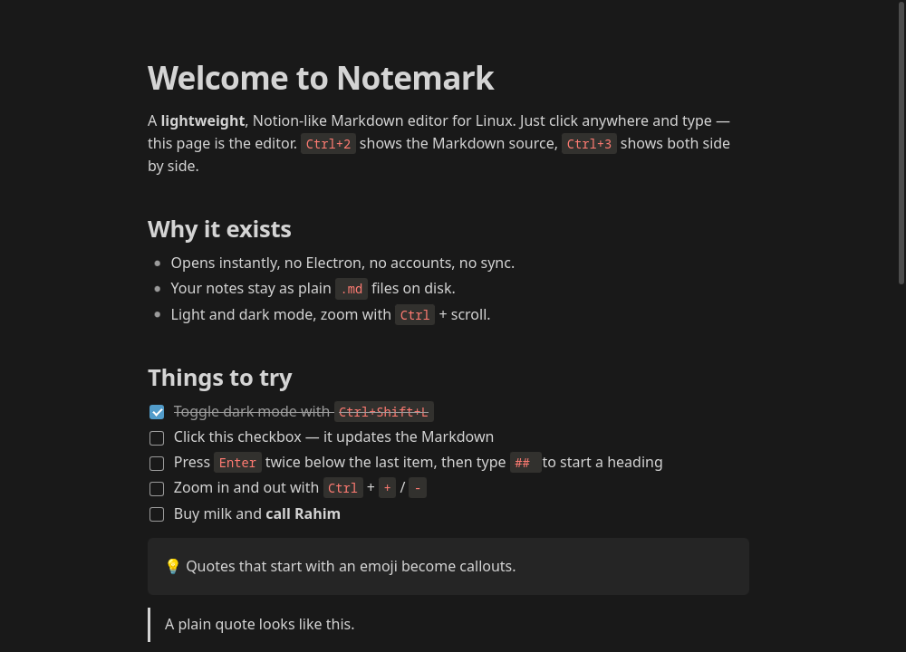

# Notemark

[](https://github.com/forhadkhan/notemark/releases/latest)
[](https://github.com/forhadkhan/notemark/releases)
[](LICENSE)

A Notion-style Markdown editor for Linux. The rendered page is the editor: you
type into formatted text, Markdown shortcuts convert as you type, and your notes
stay as plain `.md` files on disk.

No Electron, no accounts, no sync. The application is a single Python file
driving GTK 3 and WebKitGTK, and the installed package is under 250 KB.

[](https://github.com/forhadkhan/notemark/releases/latest)

| You are on | Take |
| --- | --- |
| Debian, Ubuntu, Mint, Pop!\_OS | `notemark_<version>_all.deb` |
| Anything else, no installation | `Notemark-<version>-x86_64.AppImage` |
| No root access, or prefer a portable tree | `notemark-<version>-linux.tar.gz` |

Commands for each are in [Installation](#installation) below.





## Features

- **Page mode.** A WYSIWYG editor over Markdown. Headings stay headings while
  you write, and nothing re-renders or shifts under the cursor.
- **Markdown shortcuts.** `# ` for a heading, `- ` for a bullet, `1. ` for a
  numbered item, `[] ` for a task, `> ` for a quote, ` ``` ` for code and `---`
  for a horizontal rule. Enter on an empty line leaves a list, quote or code
  block.
- **Source and split modes.** Edit raw Markdown, or both views side by side with
  two-way synchronisation.
- **Light and dark themes.** Follows the desktop colour scheme on first launch,
  and remembers your choice after that.
- **Zoom** from 50 to 300 percent, with the toolbar, keyboard, or Ctrl and the
  scroll wheel.
- **Task checkboxes** are clickable and rewrite the underlying Markdown.
- **HTML export** to a self-contained file with styles inlined.
- Word and character count, an unsaved-changes guard, and registration as a
  handler for `.md` files.

## Installation

Notemark needs Python 3.8 or newer, PyGObject, GTK 3 and WebKitGTK 4.1. Every
mainstream desktop Linux ships these; the Debian package pulls them in
automatically.

### Debian, Ubuntu and derivatives

Download `notemark_<version>_all.deb` from the
[latest release](https://github.com/forhadkhan/notemark/releases/latest) and
install it:

```bash
sudo apt install ./notemark_0.1.0_all.deb
```

### AppImage

Download `Notemark-<version>-x86_64.AppImage`, make it executable and run it:

```bash
chmod +x Notemark-0.1.0-x86_64.AppImage
./Notemark-0.1.0-x86_64.AppImage
```

The AppImage carries Notemark itself and uses GTK, WebKitGTK and PyGObject from
the host system. If they are missing it prints the exact package names to
install for your distribution.

### Portable tarball

Download `notemark-<version>-linux.tar.gz` for a build that runs in place or
installs without root:

```bash
tar -xzf notemark-0.1.0-linux.tar.gz
cd notemark-0.1.0
./notemark sample.md          # run without installing
./install.sh                  # or install into ~/.local
sudo ./install.sh /usr/local  # or system-wide
```

Run `./uninstall.sh` with the same prefix to remove it.

### From source

```bash
git clone https://github.com/forhadkhan/notemark.git
cd notemark
make run FILE=sample.md
```

Runtime dependencies, by distribution:

| Distribution   | Command                                                              |
| -------------- | -------------------------------------------------------------------- |
| Debian, Ubuntu | `sudo apt install python3-gi gir1.2-gtk-3.0 gir1.2-webkit2-4.1`       |
| Fedora         | `sudo dnf install python3-gobject gtk3 webkit2gtk4.1`                 |
| Arch           | `sudo pacman -S python-gobject gtk3 webkit2gtk-4.1`                   |
| openSUSE       | `sudo zypper install python3-gobject gtk3 libwebkit2gtk-4_1-0`        |

## Usage

Open a file from the toolbar, or pass it on the command line:

```bash
notemark notes.md
```

### Keyboard shortcuts

| Shortcut                          | Action                                   |
| --------------------------------- | ---------------------------------------- |
| `Ctrl+N`, `Ctrl+O`, `Ctrl+S`      | New, open, save                          |
| `Ctrl+Shift+S`                    | Save as                                  |
| `Ctrl+1`, `Ctrl+2`, `Ctrl+3`      | Page, source, split mode                 |
| `Ctrl+E`                          | Toggle page and source                   |
| `Ctrl+Shift+L`                    | Toggle dark mode                         |
| `Ctrl++`, `Ctrl+-`, `Ctrl+0`      | Zoom in, out, reset                      |
| `Ctrl` and scroll                 | Zoom                                     |
| `Ctrl+B`, `Ctrl+I`, `` Ctrl+` ``  | Bold, italic, inline code                |
| `Ctrl+K`, `Ctrl+Shift+X`          | Link, strikethrough                      |
| `Tab`, `Shift+Tab`                | Indent, outdent a list item              |
| `Shift+Enter`                     | Line break within a block                |
| `Ctrl` and click                  | Open a link                              |
| `Ctrl+Q`                          | Quit                                     |

Settings are stored in `~/.config/notemark/settings.json`.

## How it works

The window, header bar, file dialogs, zoom, theme and keyboard shortcuts are
GTK 3. The document itself is a WebKitGTK view loading `ui/index.html` from the
installed directory.

In page mode the rendered article is `contenteditable`. Markdown is converted to
HTML by [marked](https://github.com/markedjs/marked) when a file is loaded, and
the edited DOM is converted back to Markdown by
[Turndown](https://github.com/mixmark-io/turndown) on a short debounce, flushed
before every save. A hidden textarea holds the canonical Markdown, which is what
source mode edits directly.

The page is never re-rendered while you type, which is what keeps the cursor and
layout stable.

| Path                | Purpose                                                    |
| ------------------- | ---------------------------------------------------------- |
| `notemark.py`       | GTK application: window, dialogs, settings, zoom, theme     |
| `ui/`               | The editor page: markup, styles and editing logic          |
| `ui/vendor/`        | Bundled marked, Turndown and the Turndown GFM plugin       |
| `data/`             | Desktop entry and icon                                      |
| `packaging/`        | Build scripts for the Debian package, AppImage and tarball  |
| `tests/`            | Editor test suite driven through a headless WebKit view     |

## Building

```bash
make deb        # dist/notemark_<version>_all.deb
make appimage   # dist/Notemark-<version>-x86_64.AppImage
make tarball    # dist/notemark-<version>-linux.tar.gz
make dist       # all three
```

Building the Debian package needs `dpkg-deb`. Building the AppImage downloads
`appimagetool` into `build/tools` on first use.

`make install` performs a plain prefix install and honours `PREFIX` and
`DESTDIR`, so distribution packaging can use it directly.

## Testing

```bash
make test
```

The suite loads the editor into an offscreen WebKit view and drives it the way a
person would, then asserts on the Markdown that comes back out. It covers the
typing shortcuts, list and quote and code block behaviour, checkbox
synchronisation, inline formatting, paste, split-mode synchronisation, HTML
sanitisation, and round-trip fidelity. An X display is required; on a headless
machine run `xvfb-run -a python3 tests/test_editor.py`.

## Limitations

- A file you only read is never rewritten. Once you edit it in page mode the
  whole document is re-serialised, so alternative syntax is normalised: `*`
  bullets become `-`, setext headings become `#`, and reference links become
  inline links. This suits notes, not round-tripping someone else's carefully
  formatted Markdown.
- Tables render and can be edited cell by cell, but there is no table editing
  interface.
- Typing `**bold**` as literal syntax is escaped rather than converted. Use
  `Ctrl+B` in page mode, or write in source mode.
- The AppImage depends on host GTK and WebKitGTK rather than bundling them.

## Licence

MIT. See [LICENSE](LICENSE).

Bundled libraries, all MIT licensed, with their licence texts in `ui/vendor`:
[marked](https://github.com/markedjs/marked),
[Turndown](https://github.com/mixmark-io/turndown) and
[turndown-plugin-gfm](https://github.com/mixmark-io/turndown-plugin-gfm).
